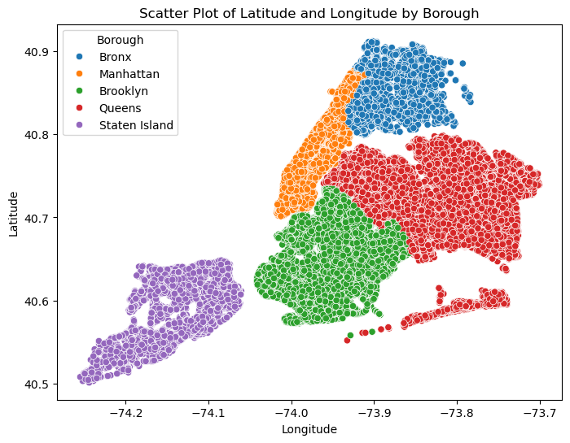
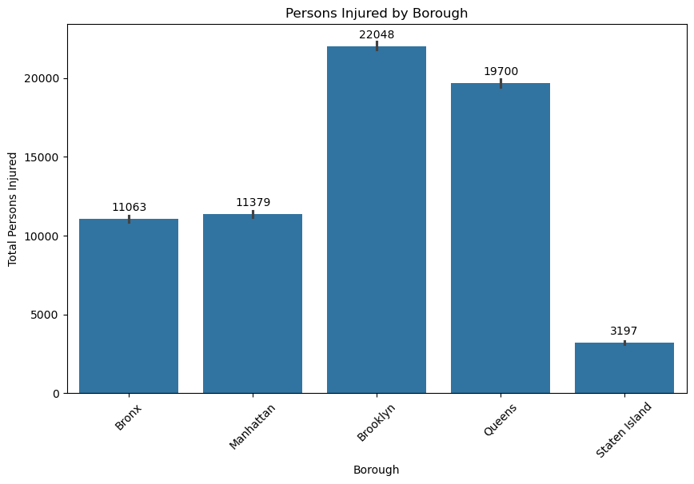
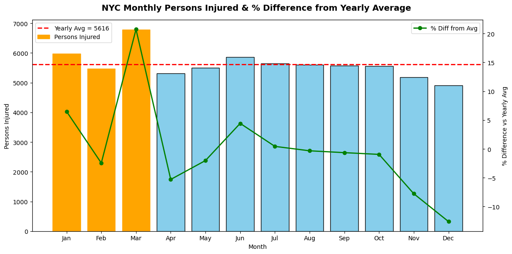

<<<<<<< HEAD
# 🚦 NYC Collisions Analysis


Analyze **motor vehicle collisions in New York City** using **data science, statistics, and machine learning**.  
This project explores **borough-level patterns, contributing factors, seasonal effects, and injury correlations** from over **230K+ collision records**.

---

## 📂 Setup Instructions
Clone the repository and set up a virtual environment:

```bash
git clone https://github.com/your-username/nyc-collisions.git
cd nyc-collisions
python -m venv .venv
source .venv/bin/activate   # Windows: .venv\Scripts\activate
pip install -r requirements.txt
```

If no `requirements.txt` is present, install manually:

```bash
pip install numpy pandas matplotlib seaborn scipy scikit-learn jupyter
```

---

## 🔄 How to Use
1. Open the notebook in **Jupyter**:
   ```bash
   jupyter notebook nyc_collisions.ipynb
   ```
2. Update the dataset path if required (replace the Colab path with local file path).  
3. Run all cells **top to bottom** to reproduce the analysis.

---

## 📊 Dataset
This project uses **one dataset**:
- `dsc project nyc.xlsx` (~238K collision records)

Key fields include:
- **Date, Time, Borough**  
- **Latitude, Longitude**  
- **Contributing Factor, Vehicle Type**  
- **Persons, Pedestrians, Cyclists, and Motorists Injured/Killed**

---

## 📈 Key Results
- 🚗 **Brooklyn & Queens** → highest number of collisions  
- 📱 **Driver inattention/distraction** → most common contributing factor  
- ☀️ **Summer months** → peak collision season  
- 🔗 **Motorist injuries** → strong correlation with overall injuries  

Example visualization:  
  



---

## 🛠️ Tech Stack
- **Python** 🐍  
- **NumPy / Pandas** → Data handling  
- **Matplotlib / Seaborn** → Visualization  
- **SciPy** → Statistical testing  
- **scikit-learn** → Regression modeling  
- **Jupyter Notebook** → Interactive analysis

---

## 🤝 Contributing
This is a proprietary project.  
Contributions are not accepted unless explicitly approved by the author.  
Please contact me before suggesting changes.

---

## 📜 License
This project is licensed under the **MIT License**.  

---

📌 **Author:** *Shivam Amitbhai Patel*
=======
# NYC-Collisions
Analyzes NYC collision data using Python and visualizations to explore accident patterns across boroughs, contributing factors, seasonal trends, and relationships between number and types of  injuries.
